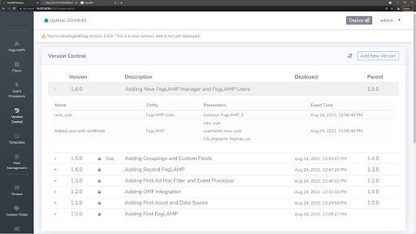
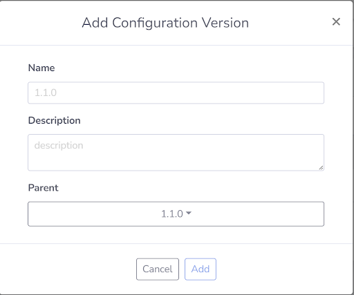
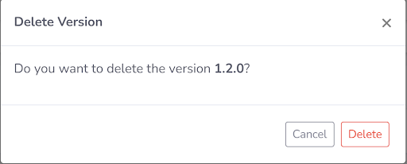
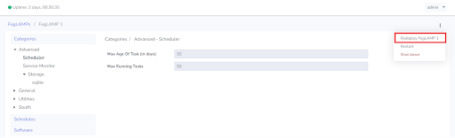

**Version Control**
===================

FogLAMP Manage Version Control Overview
---------------------------------------

FogLAMP Manage uses a versioning system for managing the configurations
of all FogLAMPs and Templates. Configuration changes occur within
versions, which provide security features as well as audit logs for
trackability. The versioning system is global, meaning that only one
FogLAMP Manage version is deployed, or "live", at any given time. The
configuration of all managed FogLAMPs will reflect the one version that
is live.

The version control model is such that configuration changes can only be
made in unlocked versions. As soon as a version is deployed it becomes
locked forever and its configuration becomes preserved. When a new
version is deployed the previous version is not unlocked, this gives the
assurance that if, at some later time, it is decided to roll back to
this previously deployed version, it remains as it was when it was last
used. In addition to rollbacks, the versioning system allows for
redeployments of the current version on a per FogLAMP basis. A redeploy
will put the FogLAMP into a fail-safe state, wipe the configuration, and
restore it with the configuration as shown in the FogLAMP Manage
version. This is useful if a FogLAMP fails to configure for any reason.

Within the Version Control page, the following information is available
per version:

-  **Version** - Semantic Versioning number following the following
   notation: MAJOR.MINOR.PATCH.

-  **Locked / Unlocked** - A lock appearing next to a version signifies
   that it has been previously deployed and now locked. An unlocked
   version has not yet been deployed and allows for changes to be
   made to a FogLAMPs configuration.

-  **Live** - Live appearing next to a version signifies that it is the
   version that is currently deployed. Only one version can be live
   at a time.

-  **Description** - Descriptions can be added to each version to
   provide information on what the version contains.

-  **Deployed** - If the version is locked, it will contain the date of
   deployment. If unlocked, the version has not yet been deployed.

-  **Parent** - The previous version that the current version was based
   on.

-  **+/-** - Buttons used to open and close the Version Logs for a given
   version.

-  **Version Logs** - Chronological logs that track every change that
   was made within the version.

Version Control Page in GUI
---------------------------

Create a New Version
~~~~~~~~~~~~~~~~~~~~

To begin creating a new version, navigate to the Version Control page
and click the **Add New Version** button. The form pictured below will
appear.

Provide the field *Name* with a version number, in the format of
MAJOR.MINOR.PATCH. For more information on how to properly determine the
version number see this external resource of `Semantic
Versioning <https://semver.org/>`__. Next provide a description of what
the version will contain. This description can be updated at any time.
Finally, select the parent version. The parent version is the version
that will be used as the basis of the newly created version. Click Add
to complete the creation of the new version.

Delete a Version
~~~~~~~~~~~~~~~~

Any version that was never deployed can be deleted.

To delete an unlocked version, navigate to the Version Control page.
Place your cursor to the right most of the desired unlocked version and
a garbage icon will appear. Clicking this will open a prompt confirming
the deletion of the version. Once a version is deleted, it can not be
recovered.

Version Control Logs
~~~~~~~~~~~~~~~~~~~~

To reveal the logs, click the + button to the left of the desired
version.

Rollbacks
~~~~~~~~~

The version control system allows for rollbacks. To rollback is to revert
the configurations of all FogLAMPs to a previously deployed FogLAMP Manage
version. This becomes useful when you have issues with a deployment and need
to revert to a known good previous version.

To execute a rollback, navigate to the Version Control page. Find the version
that you would like to revert to, select it, and finally click deploy
in the top right.

Redeploys
~~~~~~~~~

You have the ability to redeploy a version on a per FogLAMP basis. A
redeploy will put the FogLAMP into a fail-safe state, wipe the
configuration, and restore it with the configuration as shown in the
FogLAMP Manage version. You may choose to redeploy the current version
to a specific FogLAMP if an initial deployment fails to take hold on a
FogLAMP. For instance, if the FogLAMP was unreachable at the time of
deployment, you can redeploy to that foglamp to ensure that its
configuration is inline with the current version.

To execute a redeploy, navigate to the FogLAMPs page. Click the name of
the FogLAMP that you would like to redeploy to, this will open up that
specific FogLAMP’s configuration page. Click the ⋮ button at the top
right and select redeploy from the menu.

